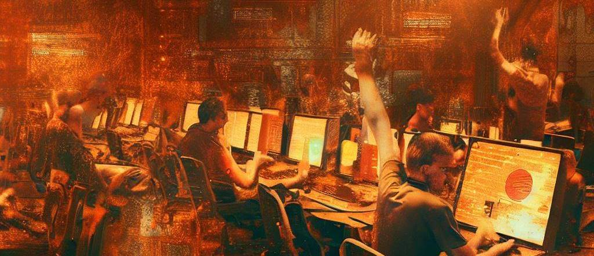

# Building a Movie Collection Manager - Full Stack Workshop with Rust, Actix, SQLx, Dioxus, and Shuttle

Welcome to the this workshop! In this hands-on workshop, we will guide you through the process of building a full stack application using Rust for the API, Actix-Web as the web framework, SQLx for database connectivity, Dioxus for the front-end, and Shuttle for deployment. This workshop assumes that you have a basic understanding of Rust and its syntax.

Throughout the workshop, you will learn how to set up a Rust project with Actix-Web, implement CRUD operations for movies, establish database connectivity with PostgreSQL using SQLx, design a responsive front-end with Dioxus, and deploy the application to a hosting environment using Shuttle.

By the end of the workshop, you will have built a functional movie collection manager application. You will understand how to create APIs with Actix-Web, work with databases using SQLx, design and develop the front-end with Dioxus, and deploy the application using Shuttle. This workshop will provide you with practical experience and insights into building full stack applications with Rust.

## Workshop Guide

You can find the workshop guide [here](https://bcnrust.github.io/devbcn-workshop/).
