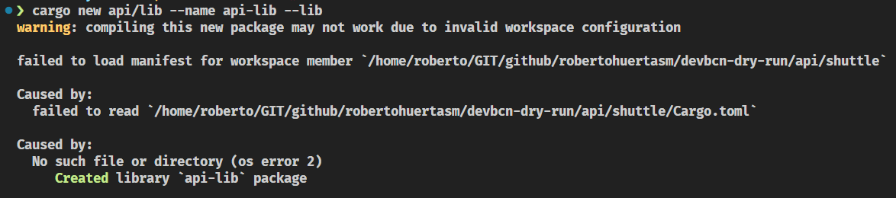
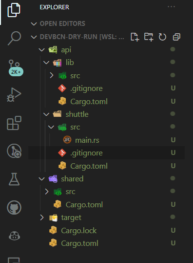
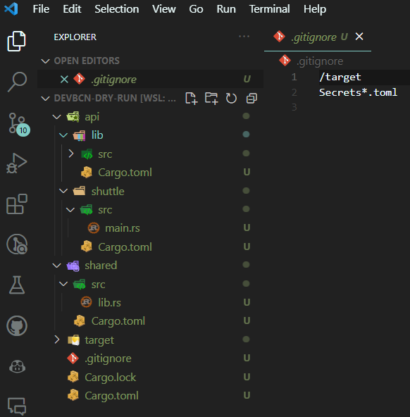

# Workspace Setup

Let's start by creating a new [workspace](https://doc.rust-lang.org/book/ch14-03-cargo-workspaces.html) for our project. 

```admonish tip title="_Cargo Workspaces_"
You can learn more about workspaces in the [Rust Book](https://doc.rust-lang.org/book/ch14-03-cargo-workspaces.html#creating-a-workspace) 
```

The basic idea is that we will create a **monorepo** with different [crates](https://doc.rust-lang.org/book/ch07-01-packages-and-crates.html) that will be compiled together.

Remember that our project will have this structure:

```txt
├── api            # Rust API code
│   ├── lib        # Actix-Web API code
│   └── shuttle    # Shuttle project
├── front          # Dioxus front-end code
├── shared         # Common code shared between the API and the front-end
└── README.md      # Workshop instructions and guidance
```

## Creating the workspace

**Create a new folder** for the project and **initialize a new workspace** by creating a `Cargo.toml` file with the following content:

```toml
[workspace]
members = [
    "api/lib",
    "api/shuttle",
    "shared"
]
resolver = "2"
```

We will add the `front` crate later, don't worry.

## Initializing the repository

Let's initialize a new git repository for our project. 

```bash
git init
```

## Creating the crates

Now that we have a **workspace**, we can create the crates that will be part of it.

For the `API`, we will create **two crates**:
- `lib`: Library containing the code for the API.
- `shuttle`: Executable for the shuttle project.

Having two different crates is totally optional, but it will allow us to have a cleaner project structure and will make it easy to reuse the `API` library code if we decide to not use [Shuttle](https://www.shuttle.rs/) in the future.

``` admonish tip title="Shuttle"
Shuttle will allow us to run our API locally and deploy it to the cloud with minimal effort but it is not required to build the API.

We could decide to use a different executable to run our API that would use the `lib` crate as a dependency. For instance, we could use Actix Web directly to create such a binary and release it as a Docker image.
```

### Creating the `lib` crate

Let's create the `lib` crate by running the following command:

```bash	
cargo new api/lib --name api-lib --lib --vcs none
```


```admonish tip title="Cargo New"
Note that we are using the `--lib` flag to create a library crate.	If you forget to add this flag, you will have to manually change the `Cargo.toml` file to make it a library crate.

The `vsc` flag is used in this case to tell `cargo` to not initialize a new git repository. Remember that we already did that in the previous step.
```

```admonish warning
Don't worry if you receive the error message below, it is expected. We will fix it later.
```



### Creating the `shuttle` crate

Let's create the `shuttle` crate by running the following command:

```bash
 cargo shuttle init api/shuttle -t actix-web --name api-shuttle
```

### Creating the `shared` crate

Finally, let's create the `shared` crate by running the following command:

```bash
cargo new shared  --lib
```

```admonish tip 
Note we're not using the `--name` flag this time. This is because the name of the crate will be inferred from the name of the folder.
```

## Buidling the project

Let's **build the project** to make sure everything is working as expected.

```bash
cargo build
```

You should see something like this:



```admonish warning
Don't commit yet as we still have some work to do!
```

As you can see, a new `target` folder has been created. This folder **contains the compiled code** for all the crates in the workspace and that's why we're seeing so many objects to be committed.

The `target` folder should be **ignored** by git. 

Let's **create** a `.gitignore` file in the **root of our repo** and add the following content:

```.gitingnore
target/
Secrets*.toml
```

Aside from that, **remove** all the `.gitignore` files from the crates as they are not needed anymore.

This is how it should look like:



## Committing the changes

If you have arrived here, you can **commit** your changes.

```bash
git add .
git commit -m "Initial commit"
```
