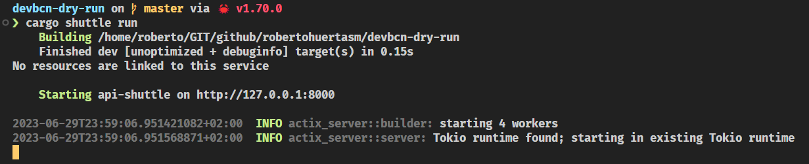

# Exploring Shuttle

Open the `api/shuttle` folder and look for the `src/main.rs` file. This is the entry point of our application.

You'll see something like this:

```rust
use actix_web::{get, web::ServiceConfig};
use shuttle_actix_web::ShuttleActixWeb;

#[get("/")]
async fn hello_world() -> &'static str {
    "Hello World!"
}

#[shuttle_runtime::main]
async fn actix_web(
) -> ShuttleActixWeb<impl FnOnce(&mut ServiceConfig) + Send + Clone + 'static> {
    let config = move |cfg: &mut ServiceConfig| {
        cfg.service(hello_world);
    };

    Ok(config.into())
}
```

[Shuttle](https://www.shuttle.rs) has generated a simple `hello-world` [Actix Web](https://actix.rs) application for us. 

As you can see, it's pretty straight-forward.

The `actix_web` function is the entry point of our application. It returns a `ShuttleActixWeb` instance that will be used by [Shuttle](https://www.shuttle.rs) to run our application.

In this function, we're going to configure our different routes. In this case, we only have one route: `/`, which is mapped to the `hello_world` function.

## Let's run it!

In the **root of the project**, run the following command:

```bash
cargo shuttle run
```

You should see something like this:



Now *curl* the `/` route:

```bash
curl localhost:8000
```

Or *open* it in your browser.

Hopefully, **you should see a greeting** in your screen! 

And that's how easy it is to create a simple API with [Shuttle](https://www.shuttle.rs)!

> Try to add more routes and see what happens!

```admonish
We're using [Actix Web](https://actix.rs) as our web framework, but **you can use any other framework** supported by [Shuttle](https://www.shuttle.rs).

Check out the [Shuttle documentation](https://docs.shuttle.rs/introduction/welcome) to learn more. Browse through the `Examples` section to see how to use [Shuttle](https://www.shuttle.rs) with other frameworks.

At the moment of writing this, [Shuttle](https://www.shuttle.rs/) supports:
- [Actix Web](https://actix.rs)
- [Axum](https://github.com/tokio-rs/axum)
- [Salvo](https://next.salvo.rs/)
- [Poem](https://github.com/poem-web/poem)
- [Thruster](https://github.com/thruster-rs/Thruster)
- [Tower](https://github.com/tower-rs/tower)
- [Warp](https://github.com/seanmonstar/warp)
- [Rocket](https://rocket.rs)
- [Tide](https://github.com/http-rs/tide)

```
