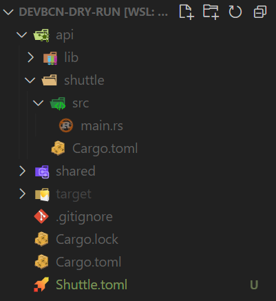
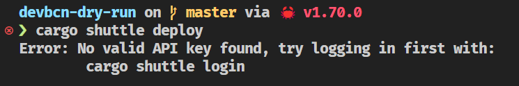
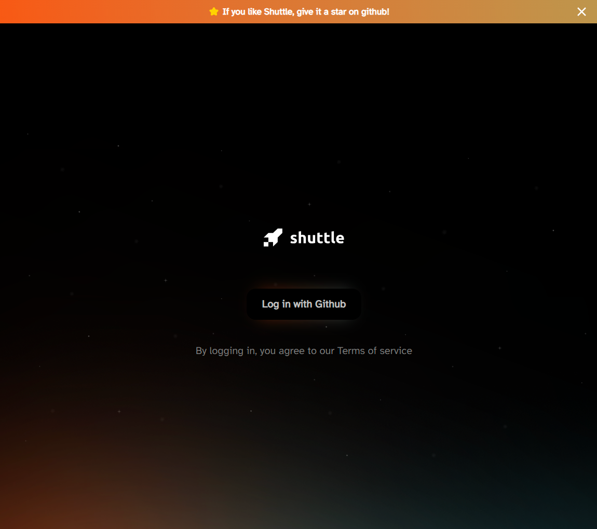
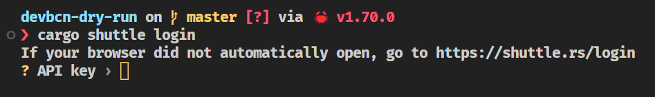
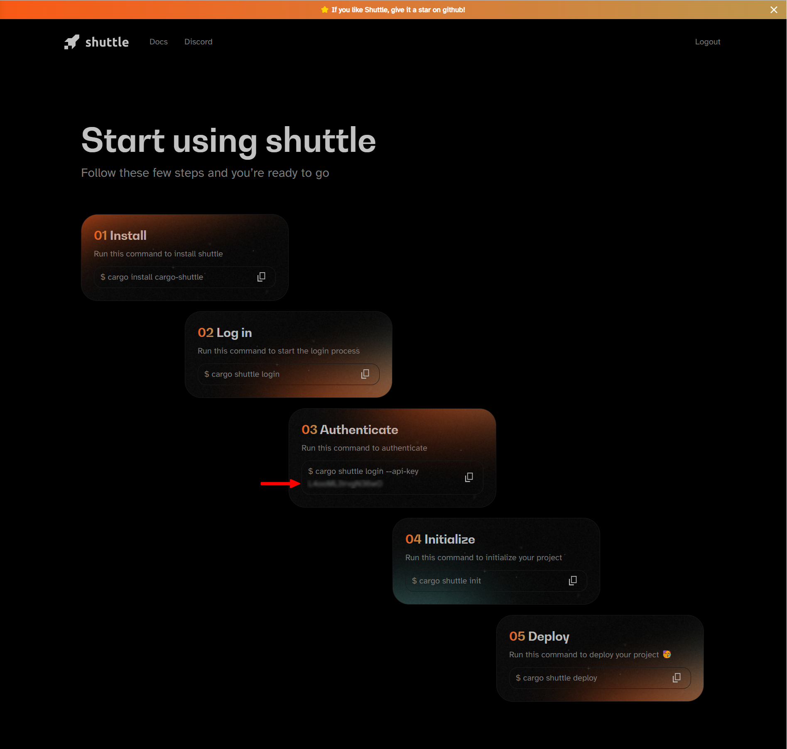
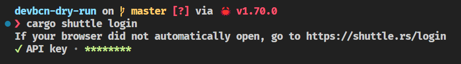
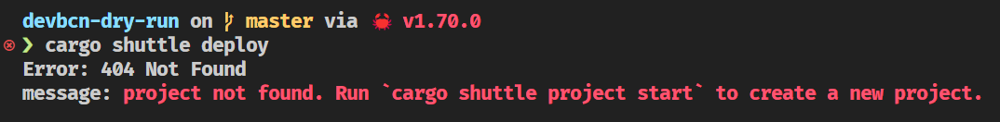
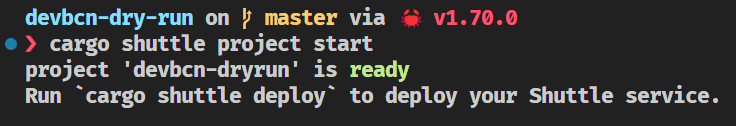
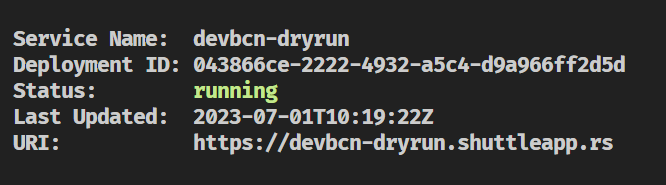

# Deploying with Shuttle

So far so good. We have a working API and we can run it locally. Now, let's deploy it to the cloud and see how easy it is to do so with Shuttle.

## Shuttle.toml file

[Shuttle](https://shuttle.rs) will use **the name of the workspace directory** as the name of the project. 

As we don't want to collide with other people having named the folder in a similar way, we will use a `Shuttle.toml` file to override the name of the project.

Go to the root of your workspace and **create a `Shuttle.toml` file** with the following content:

```toml
name = "name_you_want"
```

Your directory structure should look like this:



**Commit** the changes to your repository.

```bash
git add .
git commit -m "add Shuttle.toml file"
```

## Deploying to the cloud

Now that we have a `Shuttle.toml` file, we can **deploy our API to the cloud**. To do so, run the following command:

```bash
cargo shuttle deploy
```

You **should get an error message** similar to this one:




### Login to Shuttle

Let's do what the previous message suggests and **run** `cargo shuttle login`. 

```admonish warning
Take into account that you will need to have a [GitHub](https://github.com) account to be able to login.
```

The moment you run the `cargo shuttle login` command, you will be redirected to a [Shuttle](https://shuttle.rs) page like this so you can **authorize [Shuttle](https://shuttle.rs)** to access your [GitHub](https://github.com) account.



In your terminal, you should see something like this:



Continue the login process in your browser and **copy the code** you get in the **section 03** of the [Shuttle](https://shuttle.rs) page.



Then **paste the code** in your terminal and press enter.




### Let's deploy!

Now that we have logged in, we can **deploy our API to the cloud**. To do so, run the following command:

```bash
cargo shuttle deploy
```

Oh no! We got another **error** message:



The problem is that we haven't created the project environment yet. Let's do that now.

```bash
cargo shuttle project start
```

If everything went well, you should see something like this:



```admonish tip
Once you've done this, if you want to deploy again, you won't need to do this step again.
```

Now, let's **finally deploy our API to the cloud** by running the following command again:

```bash
cargo shuttle deploy
```

You should see in your terminal how everything is being deployed and compiled in the [Shuttle](https://shuttle.rs) cloud. This can take a while, so be patient and wait for a message like the one below:



Browse to the URI shown in the message or curl it to see the result:

```bash
curl https://<your_project_name>.shuttleapp.rs
```

*Hello world!* Easy, right? 

**We have deployed our API to the cloud!** 

```admonish tip
The URI of your project is predictable and will always conform to this convention: `https://<your_project_name>.shuttleapp.rs`.
```
