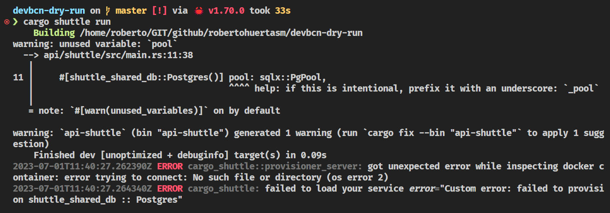
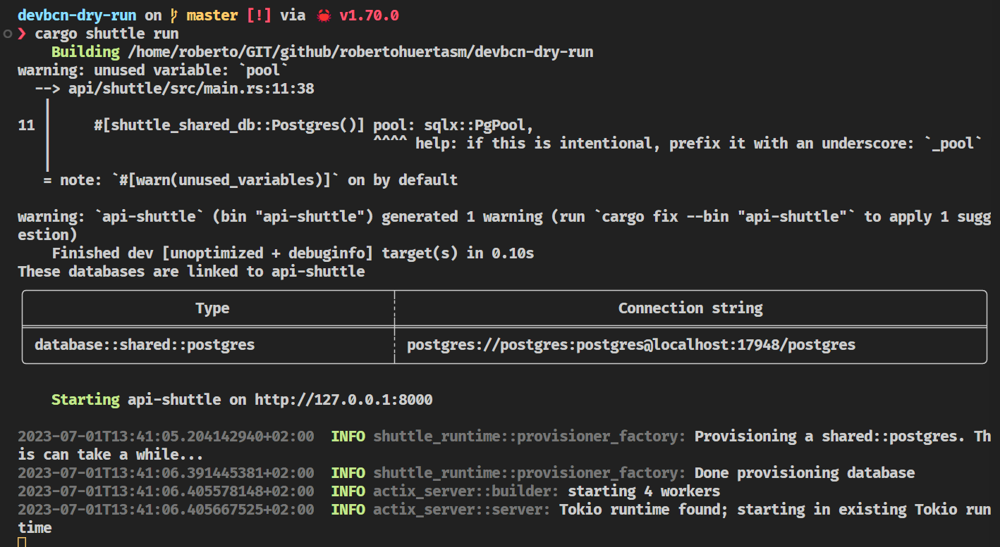

# Working with a Database

For our project we will use a [PostgreSQL](https://www.postgresql.org/) database. 

You may be already thinking about how to provision that database both locally and in the cloud, and the amount of work that it will take to do so. But no worries, we will use [Shuttle](https://shuttle.rs) to do that for us.

## Using Shuttle Shared Databases

Open [this link to the Shuttle Docs](https://docs.shuttle.rs/resources/shuttle-shared-db) and follow the instructions to create a shared database in [AWS](https://aws.amazon.com/).

As you will be able to see, just by using a [macro](https://doc.rust-lang.org/reference/procedural-macros.html) we will be able to get a database connection injected into our code and a database fully provisioned both locally and in the cloud.

So let's get started!

## Adding the dependencies

Go to the `Cargo.toml` file in the `api > shuttle` folder and add the following dependencies to the ones you already have:

```toml
[dependencies]
...
# database
shuttle-shared-db = { version = "0.36.0", features = ["postgres"] }
sqlx = { version = "0.7", default-features = false, features = [
    "tls-native-tls",
    "macros",
    "postgres",
    "uuid",
    "chrono",
    "json",
] }
```

```admonish  title="Cargo Dependencies"
If you want to learn more about how to add dependencies to your `Cargo.toml` file, please refer to the [Cargo Docs](https://doc.rust-lang.org/cargo/reference/specifying-dependencies.html).
```

We are adding the [shuttle-shared-db](https://docs.rs/shuttle-shared-db/0.21.0/shuttle_shared_db/) dependency to get the database connection injected into our code and the [SQLx](https://github.com/launchbadge/sqlx) dependency to be able to use the database connection.

Note that the [SQLx](https://github.com/launchbadge/sqlx) dependency has a lot of features enabled. We will use them later on in the project.

```admonish title="Features"
If you want to learn more about features in Rust, please refer to the [Cargo Docs](https://doc.rust-lang.org/cargo/reference/features.html).
```

## Injecting the database connection

Now that we have the dependencies, we need to inject the database connection into our code.

Open the `main.rs` file in the `api > shuttle > src` folder and add the following code as the **first parameter of the `actix_web` function**:

```rust
 #[shuttle_shared_db::Postgres()] pool: sqlx::PgPool,
 ````

The function should look like this:

```rust
#[shuttle_runtime::main]
async fn actix_web(
    #[shuttle_shared_db::Postgres()] pool: sqlx::PgPool,
) -> ShuttleActixWeb<impl FnOnce(&mut ServiceConfig) + Send + Clone + 'static> {
    let config = move |cfg: &mut ServiceConfig| {
        cfg.service(hello_world);
    };

    Ok(config.into())
}
```

Let's **build** the project. We will get a warning because we're not using the `pool` variable yet, but we will fix that in a moment.

```bash
cargo build
```

## Running the project

Now that we have the database connection injected into our code, we can run the project and see what happens.

```bash
cargo shuttle run
```

You will see that the project is building and then it will fail with the following error:



### Docker

The error is telling us that we need to have [Docker](https://www.docker.com/) running in our system.

Let's **start [Docker](https://www.docker.com/)** and run the project again.

```bash
cargo shuttle run
```

This time the project will build and run successfully.



Note that you will be able to find the **connection string to the database in the logs**. We will use that connection string later on in the project.

```admonish example "Connect to the database"
Try to connect to the database using a tool like [DBeaver](https://dbeaver.io/) or [pgAdmin](https://www.pgadmin.org/).
```


Commit your changes.

```bash
git add .
git commit -m "add database connection"
```
