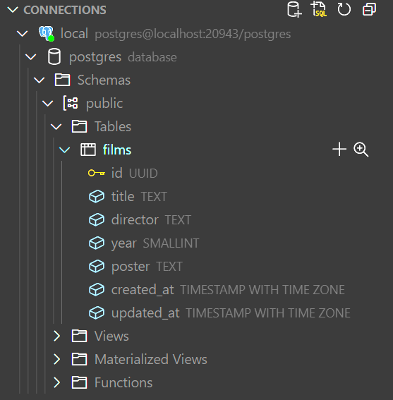

# Setting up the Database

In this section we will setup the database for our project.

This is going to be a **very simple** [CRUD](https://en.wikipedia.org/wiki/Create,_read,_update_and_delete) application, so we will only need **one table for our movies**.

## Creating the initial script

There are many ways to work with a database. We could use the [SQLx CLI](https://github.com/launchbadge/sqlx/tree/main/sqlx-cli#create-and-run-migrations) or [Refinery](https://github.com/rust-db/refinery) to create and manage our database migrations, but as this is out of the scope of this workshop, we will **create a simple script** that will create the table for us.

Create a new file `api/db/schema.sql` with the following content:

```sql
CREATE EXTENSION IF NOT EXISTS "uuid-ossp";

CREATE TABLE IF NOT EXISTS films
(
    id uuid DEFAULT uuid_generate_v1() NOT NULL CONSTRAINT films_pkey PRIMARY KEY,
    title text NOT NULL,
    director text NOT NULL,
    year smallint NOT NULL,
    poster text NOT NULL,
    created_at timestamp with time zone default CURRENT_TIMESTAMP,
    updated_at timestamp with time zone
);
```

You can see that this script will **create a table** called `films` only **if that table does not exist** yet.

## Executing the initial script

Now that we have the script, we need to execute it.

Open the `main.rs` file in the `api > shuttle > src` folder and **add the following code as the first line** in the body of the  `actix_web` function:

```rust
// initialize the database if not already initialized
pool.execute(include_str!("../../db/schema.sql"))
    .await
    .map_err(CustomError::new)?;
```

Add the following **imports to the top of the file**:
  
```rust
use shuttle_runtime::CustomError;
use sqlx::Executor;
```

```admonish warning
Be sure that the path to the `schema.sql` file is correct. Try changing the path to something else and see what happens when you try to compile the project: `cargo build`.
```

## Running the project

Let's run the project again and see if the database is created as expected.

```bash 
cargo shuttle run
```

If you check your database, you should see that the `films` table has been created:



Commit your changes.

```bash
git add .
git commit -m "setup database"
```
