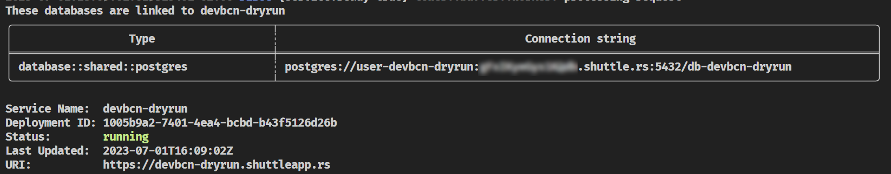
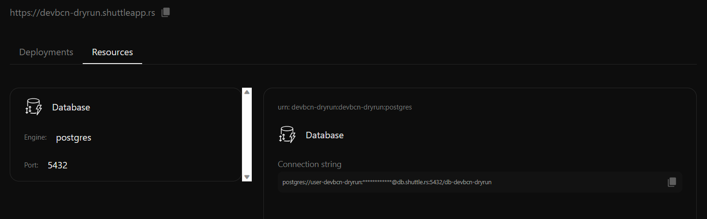

# Deploying the Database

By now, this should be a familiar process. We'll use the same `shuttle` command we used to deploy the backend to deploy the database.

```bash
cargo shuttle deploy
```

As you've seen, we **don't need to do anything special to deploy the database**. [Shuttle](https://shuttle.rs) will detect that we have a database dependency in our code and will provision it for us. Neat, isn't it?

```admonish title="Infrastructure From Code"
While the deployment takes place, you can take a look at this [blog post](https://www.shuttle.rs/blog/2022/05/09/ifc) to learn more about the concept of [Infrastructure From Code](https://www.shuttle.rs/blog/2022/05/09/ifc).
```

Once the deployment is complete, you can **check the database connection string** in the terminal.



Don't worry if you missed it. You can always **check the database connection string** in the terminal by running the following command.

```bash
cargo shuttle resource list
```

You can also go to the [Shuttle Console](https://console.shuttle.rs/) and check the database connection string there.



## Testing the new endpoint

```bash
curl -i https://your-project-name.shuttleapp.rs/version
```

You should get a response similar to the following.

```bash
HTTP/1.1 200 OK
content-length: 115
content-type: text/plain; charset=utf-8
date: Sat, 01 Jul 2023 16:27:07 GMT
server: shuttle.rs

PostgreSQL 14.8 (Debian 14.8-1.pgdg120+1) on x86_64-pc-linux-gnu, compiled by gcc (Debian 12.2.0-14) 12.2.0, 64-bit
```

