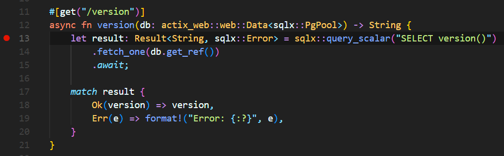
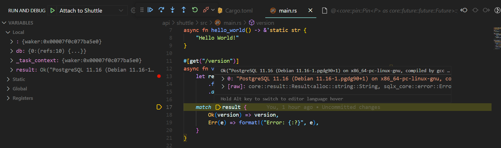

# Debugging

In the section we are going to cover how to debug the backend using [Visual Studio Code](https://code.visualstudio.com/).

Make sure that you have installed these two extensions:

- [Rust Analyzer](https://marketplace.visualstudio.com/items?itemName=matklad.rust-analyzer)
- [CodeLLDB](https://marketplace.visualstudio.com/items?itemName=vadimcn.vscode-lldb)

Once you have them installed, **create a new file** in the root of the project called `.vscode/launch.json` with the following content:

```json
{
  // Use IntelliSense to learn about possible attributes.
  // Hover to view descriptions of existing attributes.
  // For more information, visit: https://go.microsoft.com/fwlink/?linkid=830387
  "version": "0.2.0",
  "configurations": [
    {
      "type": "lldb",
      "request": "attach",
      "name": "Attach to Shuttle",
      "program": "${workspaceFolder}/target/debug/api-shuttle"
    }
  ]
}
```

The most important point to take into account here is that the `program` attribute **must point to the binary that you want to debug**.

So, in order to test that this is working, let's put a breakpoint in our `version` endpoint:




Now, run the project with `cargo shuttle run` and then press `F5` to start debugging.

`curl` the `version` endpoint:

```bash
curl -i https://localhost:8000/version
```



Commit your changes:

```bash
git add .
git commit -m "add debugging configuration"
```
