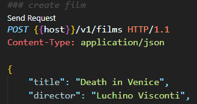

# Films endpoints

We are going to build now the endpoints needed to manage films. 

For now, don't worry about the implementation details, we will cover them in the next chapter. We will return a `200 OK` response for all the endpoints.

We're going to provide the following endpoints:

- `GET /v1/films`: returns a list of films.
- `GET /v1/films/{id}`: returns a film by id.
- `POST /v1/films`: creates a new film.
- `PUT /v1/films`: updates a film.
- `DELETE /v1/films/{id}`: deletes a film by id.

## Creating the films module

Let's start by creating the `films` module in a similar way we did with the `health` module.

Create a new file called `films.rs` in the `api > lib> src` folder and declare the module in the `lib.rs` file:

```rust
pub mod films;
```

Now, let's create a new function called `service` in the `films` module which will be responsible of declaring all the routes for the `films` endpoints. Make it public. You can base all this code in the `health` module.

> Can you guess how to create all the endpoints?

~~~admonish tip
Take a look at the [actix_web::Scope](https://docs.rs/actix-web/4.3.1/actix_web/struct.Scope.html) documentation to learn how to share a common path prefix for all the routes in the scope.
~~~


~~~admonish tip title="Solution" collapsible=true
```rust
use actix_web::{
    web::{self, ServiceConfig},
    HttpResponse,
};

pub fn service(cfg: &mut ServiceConfig) {
    cfg.service(
        web::scope("/v1/films")
            // get all films
            .route("", web::get().to(get_all))
            // get by id
            .route("/{film_id}", web::get().to(get))
            // post new film
            .route("", web::post().to(post))
            // update film
            .route("", web::put().to(put))
            // delete film
            .route("/{film_id}", web::delete().to(delete)),
    );
}

async fn get_all() -> HttpResponse {
    HttpResponse::Ok().finish()
}

async fn get() -> HttpResponse {
    HttpResponse::Ok().finish()
}

async fn post() -> HttpResponse {
    HttpResponse::Ok().finish()
}

async fn put() -> HttpResponse {
    HttpResponse::Ok().finish()
}

async fn delete() -> HttpResponse {
    HttpResponse::Ok().finish()
}

```
~~~

## Serving the films endpoints

In order to expose these newly created endpoints we need to configure the service in our `shuttle` crate.

Open the `main.rs` file in the `api > shuttle > src` folder and add a new service:

```diff
- cfg.app_data(pool).configure(api_lib::health::service);
+ cfg.app_data(pool)
+           .configure(api_lib::health::service)
+           .configure(api_lib::films::service);
```

Compile the code and check that everything works as expected.

You can use [curl](https://curl.se/) or [Postman](https://postman.com) to test the new endpoints.

Alternatively, if you have installed the [REST Client](https://marketplace.visualstudio.com/items?itemName=humao.rest-client) extension for [Visual Studio Code](https://code.visualstudio.com/), you can create a file called `api.http` in the root of the project and copy the following content:

```bash
@host = http://localhost:8000
@film_id = 6f05e5f2-133c-11ee-be9f-0ab7e0d8c876

### health
GET {{host}}/health HTTP/1.1

### create film
POST {{host}}/v1/films HTTP/1.1
Content-Type: application/json

{
    "title": "Death in Venice",
    "director": "Luchino Visconti",
    "year": 1971,
    "poster": "https://th.bing.com/th/id/R.0d441f68f2182fd7c129f4e79f6a66ef?rik=h0j7Ecvt7NBYrg&pid=ImgRaw&r=0"
}

### update film
PUT {{host}}/v1/films HTTP/1.1
Content-Type: application/json

{
    "id": "{{film_id}}",
    "title": "Death in Venice",
    "director": "Benjamin Britten",
    "year": 1981,
    "poster": "https://image.tmdb.org/t/p/original//tmT12hTzJorZxd9M8YJOQOJCqsP.jpg"
}

### get all films
GET {{host}}/v1/films HTTP/1.1

### get film
GET {{host}}/v1/films/{{film_id}} HTTP/1.1

### get bad film
GET {{host}}/v1/films/356e42a8-e659-406f-98 HTTP/1.1


### delete film
DELETE {{host}}/v1/films/{{film_id}} HTTP/1.1
```

Open it and just click on the `Send Request` link next to each request to send it to the server.



Commit your changes:
  
  ```bash
  git add .
  git commit -m "feat: add films endpoints"
  ```
