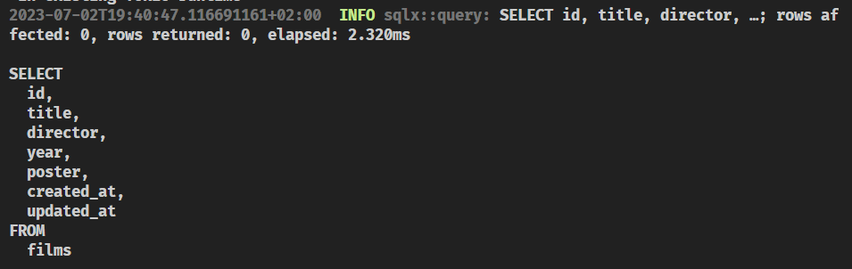

# Implementing the endpoints

In this section we are going to implement all the `film` endpoints.

One thing we know for sure is that all our handlers will need to access to a `FilmRepository` instance to do their work. 

We already injected a particular implementation of the `FilmRepository` trait in our `api-shuttle` crate, but remember that here, we don't know which particular implementation we are going to use.

Indeed, we **shouldn't care about the implementation details** of the `FilmRepository` trait in our `api-lib` crate. We should only care about the fact that we have a `FilmRepository` trait that we can use to interact with the database.

So, it seems clear that we need to get access to the `FilmRepository` instance in our handlers. But how can we do that?

```admonish tip
Refresh your memory by reading about how to handle State in Actix Web in the [official documentation](https://actix.rs/docs/application/#state).
```

As you can see, it should be pretty straightforward isn't it? But, wait a minute. We have a problem here.

In all these examples, in order **to extract a particular state we need to know its type**. But we said we don't care about the particular type of the `FilmRepository` instance, we only care about the fact that we have a `FilmRepository` instance.

How can we reconcile these two things?

We have **2 options** here.

We're going to cover them both briefly as this is out of the scope of the workshop.

## Dynamic dispatch

The first option is to use [dynamic dispatch](https://en.wikipedia.org/wiki/Dynamic_dispatch). 

This will generally make our code less performant (some times it doesn't really matter) but it will allow us to easily **abstract away the particular trait implementations**.

```admonish info title="Trait Objects"
Learn more about this topic in the [official Rust book](https://doc.rust-lang.org/book/ch17-02-trait-objects.html).
```

The basic idea here is that we will use a `Box<dyn FilmRepository>` as our state type. This will allow us to store any type that implements the `FilmRepository` trait in our state.

```diff
- let film_repository = actix_web::web::Data::new(film_repository);
+ let film_repository: actix_web::web::Data<Box<dyn api_lib::film_repository::FilmRepository>> =
+       actix_web::web::Data::new(Box::new(film_repository));
```

Then, in our handlers, we will add this parameter:

```rust
repo: actix_web::web::Data<Box<dyn crate::film_repository::FilmRepository>>
```

For instance, in our `get_all` handler, we would use it like this:

```rust
 match repo.get_films().await {
    Ok(films) => HttpResponse::Ok().json(films),
    Err(e) => HttpResponse::NotFound().body(format!("Internal server error: {:?}", e)),
}
```

If you test that endpoint, you will see that it works as expected. 

If you look into your terminal, you should be able to see the SQL query that was executed:



This is fairly easy, it works, and it's a common option.

Let's implement all the endpoints with this approach and then we'll see the second option.

## Implementing the endpoints

> Do you want to give it a try?


~~~admonish tip title="Solution" collapsible=true
Make sure your code in the `api-lib/src/film.rs` file looks like this:

```rust
use actix_web::{
    web::{self, ServiceConfig},
    HttpResponse,
};
use shared::models::{CreateFilm, Film};
use uuid::Uuid;

use crate::film_repository::FilmRepository;

type Repository = web::Data<Box<dyn FilmRepository>>;

pub fn service(cfg: &mut ServiceConfig) {
    cfg.service(
        web::scope("/v1/films")
            // get all films
            .route("", web::get().to(get_all))
            // get by id
            .route("/{film_id}", web::get().to(get))
            // post new film
            .route("", web::post().to(post))
            // update film
            .route("", web::put().to(put))
            // delete film
            .route("/{film_id}", web::delete().to(delete)),
    );
}

async fn get_all(repo: Repository) -> HttpResponse {
    match repo.get_films().await {
        Ok(films) => HttpResponse::Ok().json(films),
        Err(e) => HttpResponse::NotFound().body(format!("Internal server error: {:?}", e)),
    }
}

async fn get(film_id: web::Path<Uuid>, repo: Repository) -> HttpResponse {
    match repo.get_film(&film_id).await {
        Ok(film) => HttpResponse::Ok().json(film),
        Err(_) => HttpResponse::NotFound().body("Not found"),
    }
}

async fn post(create_film: web::Json<CreateFilm>, repo: Repository) -> HttpResponse {
    match repo.create_film(&create_film).await {
        Ok(film) => HttpResponse::Ok().json(film),
        Err(e) => {
            HttpResponse::InternalServerError().body(format!("Internal server error: {:?}", e))
        }
    }
}

async fn put(film: web::Json<Film>, repo: Repository) -> HttpResponse {
    match repo.update_film(&film).await {
        Ok(film) => HttpResponse::Ok().json(film),
        Err(e) => HttpResponse::NotFound().body(format!("Internal server error: {:?}", e)),
    }
}

async fn delete(film_id: web::Path<Uuid>, repo: Repository) -> HttpResponse {
    match repo.delete_film(&film_id).await {
        Ok(film) => HttpResponse::Ok().json(film),
        Err(e) => {
            HttpResponse::InternalServerError().body(format!("Internal server error: {:?}", e))
        }
    }
}
```
~~~

Test the API by using the `api.http` file if you created it in one of the previous sections or by using any other tool.

Commit your changes:

```bash
git add .
git commit -m "implement film endpoints"
```
