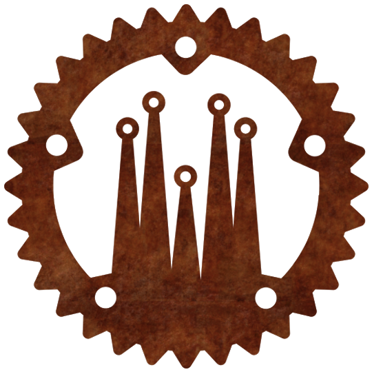

# Starting the Application

Before we proceed, let's ensure that your project directory structure is set up correctly. Here's how the `front` folder should look:

```bash
front
├── Cargo.toml
├── src
│   └── main.rs
├── public
│   └── ... (place your static files here such as images)
├── input.css
├── tailwind.config.js
└── Dioxus.toml
```

Let's detail the contents:

- `Cargo.toml`: The manifest file for Rust's package manager, Cargo. It holds metadata about your crate and its dependencies.

- `src/main.rs`: The primary entry point for your application. It contains the main function that boots your Dioxus app and the root component.

- `public`: This directory is designated for public assets for your application. Static files like images should be placed here. Also, the compiled CSS file (`tailwind.css`) from the Tailwind CSS compiler will be output to this directory.

- `input.css`: An input file for the Tailwind CSS compiler, which includes the basic Tailwind directives.

- `tailwind.config.js`: The configuration file for Tailwind CSS. It instructs the compiler where to find your source files and other configuration details.

- `Dioxus.toml`: This configuration file for Dioxus stipulates application metadata and build configurations.

## Image resources

For this workshop, we have prepared a set of default images that you will be using in the development of the application. Feel free to use your own images if you wish.

The images should be placed as follows:

```bash
public
├── image1.png
├── image2.png
├── image3.png
└── ... (rest of your images)
```



Now that we've confirmed the directory structure, let's proceed to initialize your application...

To initialize your application, modify your `main.rs` file as follows:

```rust
#![allow(non_snake_case)]
// Import the Dioxus prelude to gain access to the `rsx!` macro and the `Scope` and `Element` types.
use dioxus::prelude::*;

fn main() {
    // Launch the web application using the App component as the root.
    dioxus_web::launch(App);
}

// Define a component that renders a div with the text "Hello, world!"
fn App(cx: Scope) -> Element {
    cx.render(rsx! {
        div {
            "Hello, DevBcn!"
        }
    })
}
```

With this setup, we've created a basic Dioxus web application that will display "Hello, world!" when run.

To launch our application in development mode, we'll need to perform two steps concurrently in separate terminal processes. Navigate to the `front` crate folder that was generated earlier, and proceed as follows:

1. **Start the Tailwind CSS compiler**: Run the following command to initiate the Tailwind CSS compiler in watch mode. This will continuously monitor your `input.css` file for changes, compile the CSS using your Tailwind configuration, and output the results to `public/tailwind.css`.

```bash
npx tailwindcss -i ./input.css -o ./public/tailwind.css --watch
```

2. **Launch Dioxus in serve mode**: Run the following command to start the Dioxus development server. This server will monitor your source code for changes, recompile your application as necessary, and serve the resulting web application.

```bash
dioxus serve --port 8000
```

Now, your development environment is up and running. Changes you make to your source code will automatically be reflected in the served application, thanks to the watching capabilities of both the Tailwind compiler and the Dioxus server. You're now ready to start building your Dioxus application!

## Logging

For applications that run in the browser, having a logging mechanism can be very useful for debugging and understanding the application's behavior.

The first step towards this involves installing the `wasm-logger` crate. You can do this by running the following command:

```diff
...
[dependencies]
# dioxus
dioxus = "0.4.3"
dioxus-web = "0.4.3"
+log = "0.4.19"
+wasm-logger = "0.2.0"
```

Once `wasm-logger` is installed, you need to initialize it in your `main.rs` file. Here's how you can do it:

`main.rs`
```diff
...
fn main() {
+   wasm_logger::init(wasm_logger::Config::default().module_prefix("front"));
    // launch the web app
    dioxus_web::launch(App);
}
...
```

With the logger initialized, you can now log messages to your browser's console. The following is an example of how you can log an informational message:

```admonish example
log::info!("Message on my console");
```

By using this logging mechanism, you can make your debugging process more straightforward and efficient.
