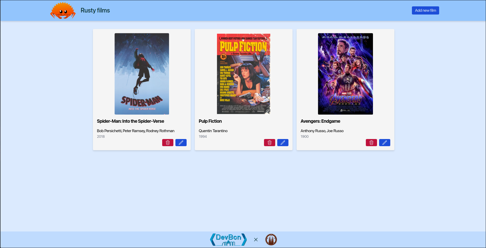

# Building for production

Inside our workspace **root** we some handy `cargo-make` tasks for the frontend also. Let's use one of them for building our frontend for production.

```bash
makers front-build
```

This will build our frontend for production and place the output in the `shuttle/static` directory. Now we can serve our frontend with the backend. Let's deploy it with Shuttle and see our results.

```bash
cargo shuttle deploy
```

Once the app is deploy it will look like this if everything went well.
